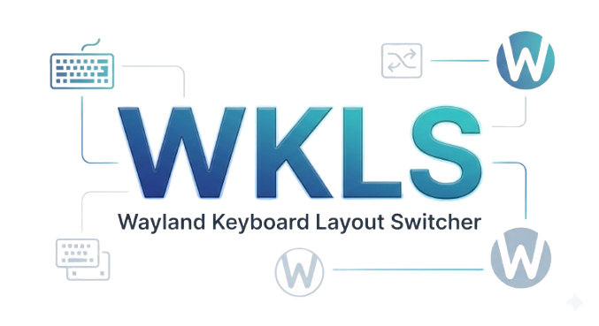

<div align="center">
  
  <p><b>WKLS - Wayland Keyboard Layout Switcher</b></p>
  <p>
    <a href="https://www.python.org/"></a>
    <a href="#"></a>
    <a href="#"></a>
  </p>
</div>


---

An easy-to-use utility for converting selected text between different keyboard layouts. No more manually re-typing that messed-up text all over again. Just bind a handy keybinding in your system settings and you're good to go!


## ✨ Features

- [x] Multi-lingual layout switching
- [x] Layout customization
- [x] Smart layout switching rules
- [x] Automatic customizable timestamps
- [ ] Uppercase/Lowercase switching (Coming soon)


## 📦 Prerequisites

Since this tool is built specifically for the Wayland ecosystem, make sure you have the following packages installed on your system:
* `wl-clipboard` (for reading and writing to the clipboard)
* `libnotify` / `notify-send` (for system pop-up notifications)


## ⚙️ Installation

1. **Download and prepare the script:**
   Download the latest release (or clone the repo), and place `wkls.py` in a directory of your choice. It's recommended to put it in your user binaries path:
   ```bash
   # Make the script executable
   chmod +x wkls.py
   
   # Move it to a secure binary folder (optional but recommended)
   sudo mv wkls.py /usr/local/bin/wkls
   ```

2. **Set up the Keybinding:**
   - Go to your Desktop Environment's shortcut settings (e.g., in KDE Plasma: `System Settings -> Keyboard -> Shortcuts`).
   - Click `Add -> Command or script`.
   - Give it a name (like "Layout Switcher") and paste the path to your script (`/usr/local/bin/wkls`).
   - Assign a convenient shortcut (e.g., `Meta + X`).
   - Apply the settings and you're done!


## 🚀 Quick Start

Select any text, press `Ctrl+C` (or simply highlight it if your DE supports primary selection), and trigger your shortcut. 

You can also run it via CLI:

```bash
# By default, converts your selected text based on the custom switching rules 
# and saves the result directly to your clipboard.
$ wkls.py

# Adds a timestamp to your clipboard. 
# STRFTIME format can be customized right inside the script.
$ wkls.py -t 
# or
$ wkls.py --timestamp
```


## 🛠️ Configuration

The script is highly customizable. You can easily add new languages or change how the layouts transition into each other by opening `wkls.py` in any text editor and modifying the top config section:

* **`LAYOUTS`**: Add or remove keyboard layouts (ensure all strings have the exact same length and matching key positions).
* **`TRANSITIONS`**: Define explicit rules for switching (e.g., set `2: 1` if you want a specific layouts to always convert to some layout rather than another ones).


## ⚠️ Important Notes

* **Wayland Only:** This script relies on `wl-clipboard`, making it a native Wayland solution. It will not work on X11 sessions out of the box (though you could adapt it using `xclip`).
* **Security:** Unlike older X11 tools, WKLS does not require root privileges, `ydotool` daemons, or adding your user to the `input` group. It securely manipulates text solely through standard clipboard protocols.
* **The `Ctrl+A` Quirk:** WKLS reads text directly from the Wayland *Primary Selection* (text that is currently highlighted on your screen). Be aware that certain applications (like Firefox, particularly in the URL bar) intentionally block the `Ctrl+A` shortcut from updating the Primary Selection to prevent accidental clipboard overwriting. If WKLS notifies you that no text is selected after using `Ctrl+A`, simply highlight the text using your mouse or `Shift + Arrow keys` instead.
